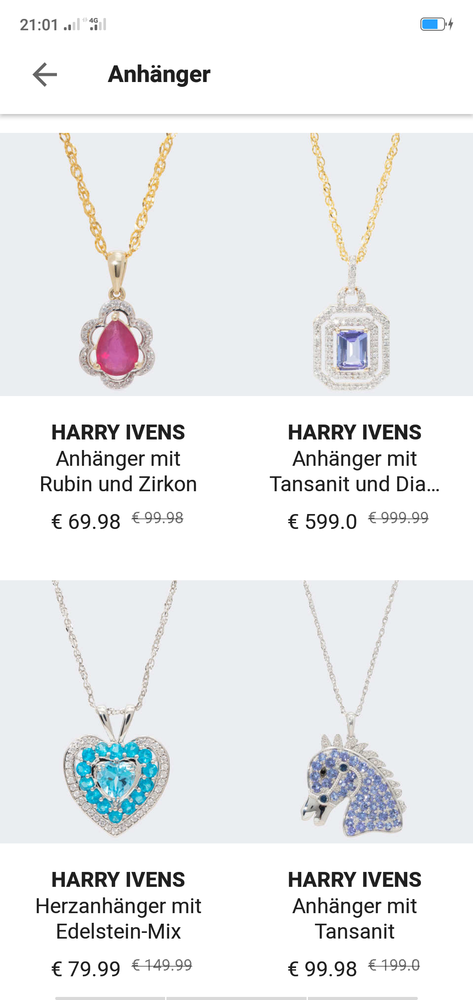
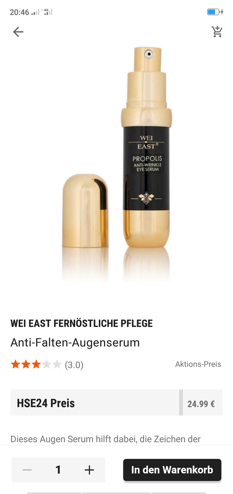
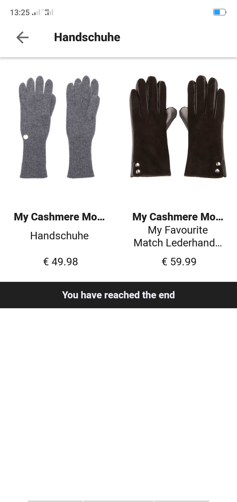
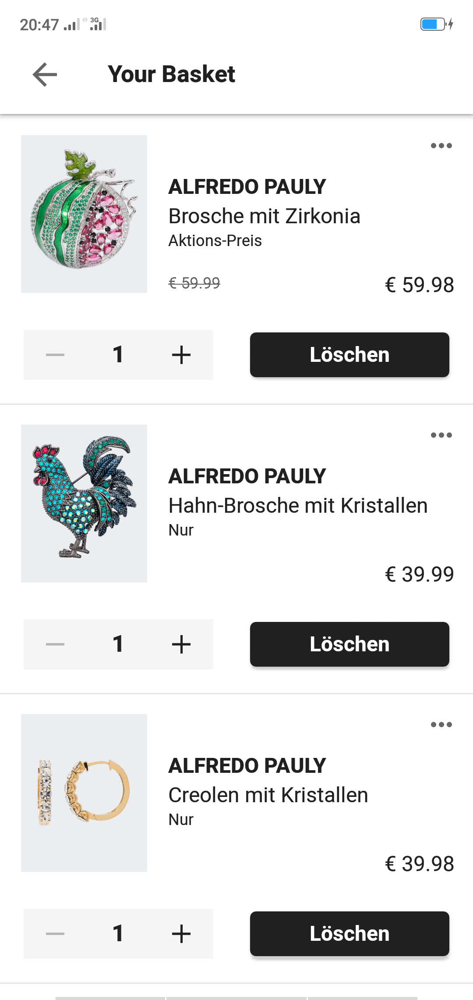

# HSE24 Interview

HSE24 App is a simple E-Commerce App with a professional and clean code built using kotlin.

## Table Of Content

* [General Info](#general-info)
* [Implemented Tasks](#implemented-tasks)
* [Technologies Used](#technologies-used)
* [Screenshots](#screenshots)

## General Info

HSE24 support Model–view–viewModel (MVVM) as the architectural design pattern of our project, also it support the REST APIS to retrieve products and categories from the HSE24 WebServer.

## Implemented Tasks

### REST Interfaces:

HSE24 App support REST Interfaces in order to get category & product information from the WebServer.

### Infinite Scrolling:

HSE24 App support a product Lists with infinite Scrolling using [paging library](https://github.com/mirmilad/paging-coroutine) and it has the ability to get a product detail Page.

### Basket:

HSE24 App support the ability to add products to a local basket using [Room Database library](https://developer.android.com/jetpack/androidx/releases/room). and it support also the ability to delete products from the Basket.

### Great Design

Design inspiration from the original HSE24 App

## Technologies Used

Project is created with:

* [Kotlin 1.3.41](https://github.com/kotlin)
* [Model View viewModel](https://github.com/taehwandev/LifecycleExtensions)
* [LiveData 2.2.0](https://github.com/taehwandev/LifecycleExtensions)
* [Retrofit 2.5.0](https://github.com/square/retrofit)
* [RxJava 2.5.0](https://github.com/ReactiveX/RxAndroid)
* [Room Database 2.2.5](https://developer.android.com/jetpack/androidx/releases/room)
* [Coroutines 1.3.5](https://developer.android.com/jetpack/androidx/releases/room)
* [Pagination Infinite Scrolling 2.1.0](https://github.com/mirmilad/paging-coroutine)
* [Gson 2.8.5](https://github.com/google/gson)
* [Glide 4.8.0](https://github.com/bumptech/glide)
* [Material Rating Bar 1.4.0](https://github.com/zhanghai/MaterialRatingBar)
* [Circle Image View 3.1.0](https://github.com/hdodenhof/CircleImageView)
* [SnackBar 1.2.0](https://material.io/components/snackbars)

## Screenshots

   

  

